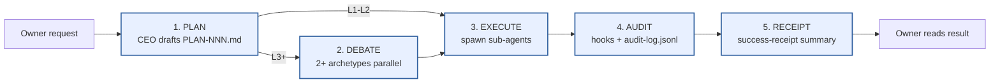
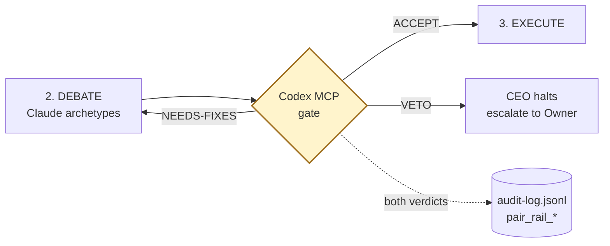
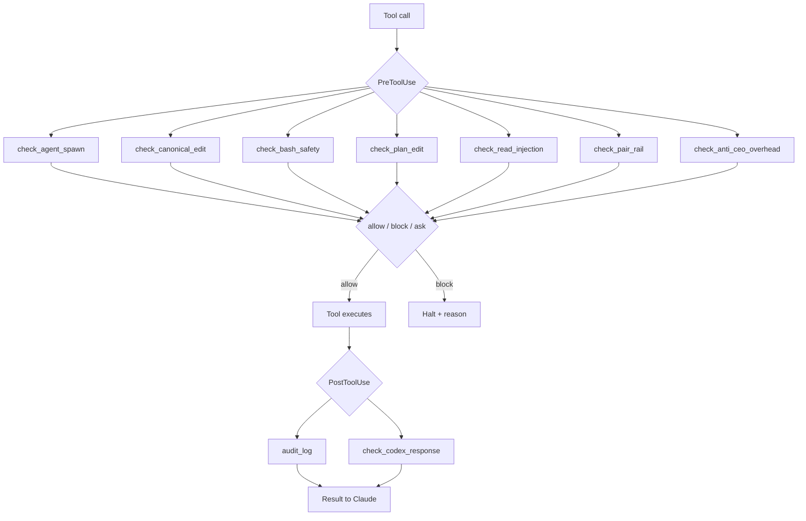
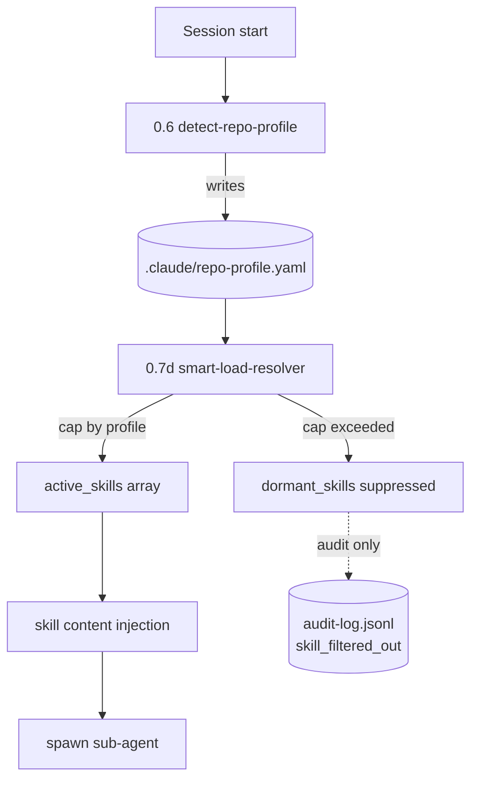
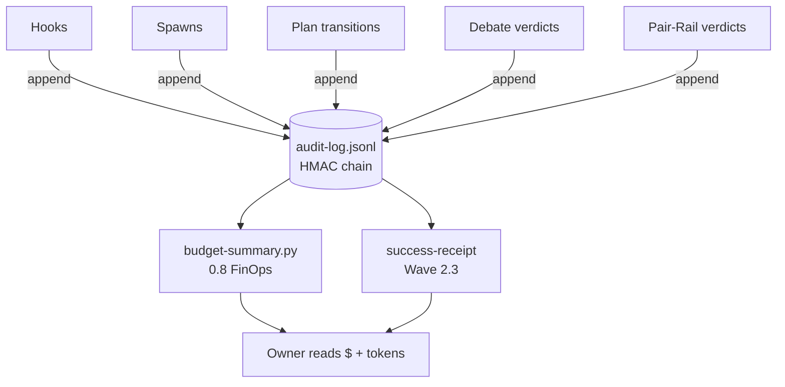
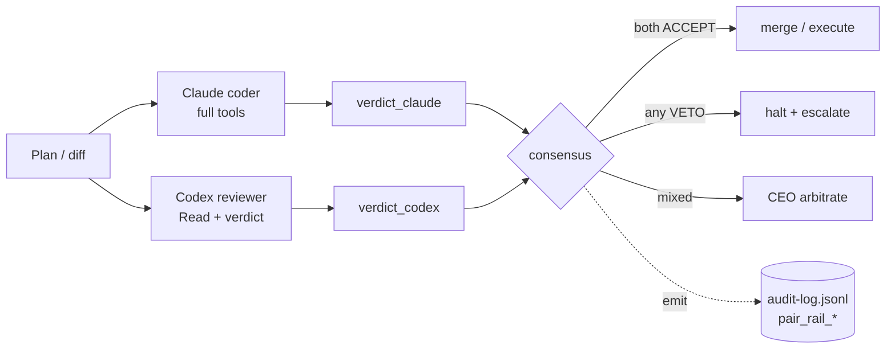

# Architecture Diagram — ceo-orchestration

> **Post-apply path:** `docs/ARCHITECTURE-DIAGRAM.md`
> **Companion docs:** `docs/DECISION-LOG.md`, `docs/WHAT-WE-ARE.md`, `PROTOCOL.md`
> **PNG note:** PNG export deferred to v1.1 per PLAN-083 §8 Q4. ASCII renders in any
> terminal; Mermaid renders inline on GitHub, GitLab, VS Code, and most MD viewers.

This document is the single visual reference for how a request travels through the
framework. Every box maps to a real file, hook, or audit event. If a diagram and the
code disagree, the **code wins** — open an issue against this doc.

---

## §1. The 5-stage canonical flow (ASCII)

Owner sends a request; CEO drives 5 stages; the loop ends with a Receipt the Owner
can read in one screen.

```
  Owner request
        │
        ▼
  ┌───────────┐    ┌───────────┐    ┌───────────┐    ┌───────────┐    ┌───────────┐
  │ 1. PLAN   │───▶│ 2. DEBATE │───▶│ 3. EXECUTE│───▶│ 4. AUDIT  │───▶│ 5. RECEIPT│
  └─────┬─────┘    └─────┬─────┘    └─────┬─────┘    └─────┬─────┘    └─────┬─────┘
        │                │                │                │                │
   who: CEO         who: 2+ archetypes  who: sub-agents  who: hooks +    who: success-
   art: PLAN-NNN    art: round-N        art: code +      audit-log       receipt
        .md            consensus.md        tests             .jsonl       (Wave 2.3)
   emit:            emit:                emit:           emit:           emit:
   plan_drafted     debate_round_open   tool_call_*      hook_decision_  receipt_
                    debate_verdict      spawn_*           allow/block     summary
                                        audit_chain_*
```

Stage details:

- **1. Plan** — CEO writes a `.claude/plans/PLAN-NNN-slug.md` with frontmatter
  (status, blast radius, debate_required, related ADRs). L1-L2 plans skip stage 2.
- **2. Debate** — for L3+, CEO spawns 2+ archetypes in parallel; each critiques
  from its skill perspective. Output: `consensus.md`. If 2+ archetypes flag the
  same risk, the plan **must** be adjusted.
- **3. Execute** — CEO spawns sub-agents per `## FILE ASSIGNMENT`; each loads its
  persona + skill (Format A inline or Format B reference per ADR-051).
- **4. Audit** — every hook decision, spawn, and tool call writes one JSONL line
  to `~/.claude/projects/<slug>/audit-log.jsonl`; HMAC-chained (ADR-064).
- **5. Receipt** — `success-receipt` (PLAN-083 Wave 2.3) reads the audit log and
  produces a per-session "files inspected / risks found / actions taken / value
  created / next move" summary in one screen.

---

## §2. Mermaid version of §1



---

## §3. Pair-Rail integration (Codex MCP gate)

The Pair-Rail (PLAN-081) intercepts between **Debate** and **Execute** for L3+
plans, and pre-merge for any canonical edit. Coder is Claude; reviewer is Codex
(or the asymmetric pair per the routing matrix). When the reviewer VETOs, both
verdicts land in the audit log.

```
                          ┌──────────────────────┐
   Stage 2: DEBATE   ────▶│  Codex MCP gate      │────▶  Stage 3: EXECUTE
   (Claude archetypes)    │  (cross-LLM review)  │       (only if ACCEPT)
                          └──────────┬───────────┘
                                     │ verdict:
                                     │  ACCEPT / NEEDS-FIXES / VETO
                                     ▼
                              audit-log.jsonl
                              action: pair_rail_case
                                      pair_rail_promotion
                                      pair_rail_codex_injection_detected
```



Routing matrix (PLAN-081): each archetype has an asymmetric pair. Example —
`code-reviewer` (Claude) ↔ `code-review-checklist-codex` (Codex). The reviewer
side has no Edit/Write tools; only Read + verdict emission.

---

## §4. The hook layer (PreToolUse + PostToolUse)

Every tool call passes through a chain of Python hooks before reaching Claude's
tool implementation. Hooks are stdlib-only, fail-open on infrastructure errors,
fail-CLOSED on governance violations.

```
   Claude Code tool call (Edit / Write / Task / Bash / Read)
        │
        ▼
  ┌────────────────────────────── PreToolUse chain ────────────────────────────┐
  │                                                                             │
  │   check_agent_spawn.py       — Task tool: persona + skill + file assign     │
  │   check_canonical_edit.py    — Edit/Write: KERNEL HARD-DENY paths           │
  │   check_bash_safety.py       — Bash: rm -rf, force-push, network egress     │
  │   check_plan_edit.py         — Edit: PLAN-NNN.md schema + status transition │
  │   check_read_injection.py    — Read: NFKC homoglyph + prompt injection      │
  │   check_pair_rail.py         — Task: dispatch_archetype + Codex pair gate   │
  │   check_anti_ceo_overhead.py — Task: CEO doing sub-agent-shaped work (W0a)  │
  │                                                                             │
  └────────────────────────────────────┬────────────────────────────────────────┘
                                       │
                            decision: allow / block / ask
                                       │
                                       ▼
                            Claude executes tool
                                       │
                                       ▼
  ┌────────────────────────── PostToolUse chain ───────────────────────────────┐
  │                                                                             │
  │   audit_log.py               — every tool: append HMAC-chained JSONL        │
  │   check_codex_response.py    — Codex MCP: ingress sanitize (3 patterns)     │
  │                                                                             │
  └────────────────────────────────────┬────────────────────────────────────────┘
                                       │
                                       ▼
                           tool result returned to Claude
```



---

## §5. Smart-loading flow (PLAN-083 Wave 0a + 0b)

Repo detection runs once per session; resolver produces an active skill set bounded
by a per-profile cap; only those skills' SKILL.md content is injected into spawn
prompts.

```
   Session start
        │
        ▼
  ┌─────────────────────────┐
  │ 0.6 detect-repo-profile │   reads: package.json, pyproject.toml, .env*,
  │                         │          docker-compose.yml, file globs
  └──────────┬──────────────┘
             │ writes: .claude/repo-profile.yaml
             │ profile ∈ {frontend, engine, fintech, trading-readonly, generic}
             ▼
  ┌─────────────────────────┐
  │ 0.7d smart-load-resolver│   inputs: repo-profile + skill-binding.schema
  │                         │   caps:  fe ≤10  engine ≤12  fintech ≤15
  └──────────┬──────────────┘           trading ≤8  generic ≤6
             │
             │ outputs: active_skills[] (≤ cap)
             │          dormant_skills[] (suppressed but logged)
             ▼
  ┌─────────────────────────┐
  │ skill content injection │   for each active skill:
  │                         │     read SKILL.md → cache by sha256
  └──────────┬──────────────┘
             │
             ▼
   spawn(sub-agent) with persona + active skill content + file assignment
```



---

## §6. The audit + receipt loop

`audit-log.jsonl` is the central spine. Every hook decision, every spawn, every
status transition writes one line. Downstream readers produce summaries.

```
                            ┌──────────────────────────┐
                            │   audit-log.jsonl        │
                            │   (HMAC-chained, append) │
                            └────────────┬─────────────┘
                                         ▲
   hooks write ─────────────────────────┤
   spawns write ────────────────────────┤
   plan transitions write ──────────────┤
   debate verdicts write ───────────────┤
   pair-rail verdicts write ────────────┤
                                         │
                                         ▼
                  ┌──────────────────────┴──────────────────────┐
                  │                                              │
                  ▼                                              ▼
       budget-summary.py (0.8)                          success-receipt (2.3)
       reads cost + tokens                              reads per-session events
       outputs $ + token total                          outputs 5-line summary:
                                                         · files inspected
                                                         · risks found
                                                         · actions taken
                                                         · value created
                                                         · next move
```



---

## §7. Cross-LLM Pair-Rail topology

Per PLAN-081 routing matrix, each archetype has a coder side (Claude) and a
reviewer side (Codex). Both verdicts are written to the audit log; consensus
(or VETO) drives the gate.

```
   Archetype: code-reviewer
   ────────────────────────
              ┌─────────────────────────┐   ┌─────────────────────────┐
   plan/diff ─│  Claude (coder rail)    │   │  Codex (reviewer rail)  │─ plan/diff
              │  full tools             │   │  Read + verdict only    │
              │  produces patch         │   │  produces verdict       │
              └────────────┬────────────┘   └────────────┬────────────┘
                           │                              │
                           ▼                              ▼
                     verdict_claude                verdict_codex
                           │                              │
                           └──────────────┬───────────────┘
                                          ▼
                              ┌───────────────────────┐
                              │  consensus rule       │
                              │  both ACCEPT → merge  │
                              │  any VETO → halt      │
                              │  mixed → CEO arbitrate│
                              └───────────┬───────────┘
                                          │
                                          ▼
                                  audit-log.jsonl
                                  action: pair_rail_case
                                          pair_rail_promotion
```



---

## Footnotes

- **Why no PNG?** Diagrams-as-code (ASCII + Mermaid) survives git diff, renders
  without tooling, and is editable by any contributor. PNG export is a product
  surface (Cursor / VS Code preview), deferred to v1.1 per PLAN-083 §8 Q4.
- **Why 5 stages?** Plan → Debate → Execute → Audit → Receipt matches the
  governance loop in `PROTOCOL.md` §Plan → Debate → Execute, extended with the
  always-on Audit hook layer (ADR-064) and the Receipt UX layer (PLAN-083 Wave 2.3).
- **Where does the Pair-Rail fit?** Between Debate and Execute for L3+, and as a
  pre-merge gate for canonical edits. See `docs/threat-model-pair-rail.md`.
